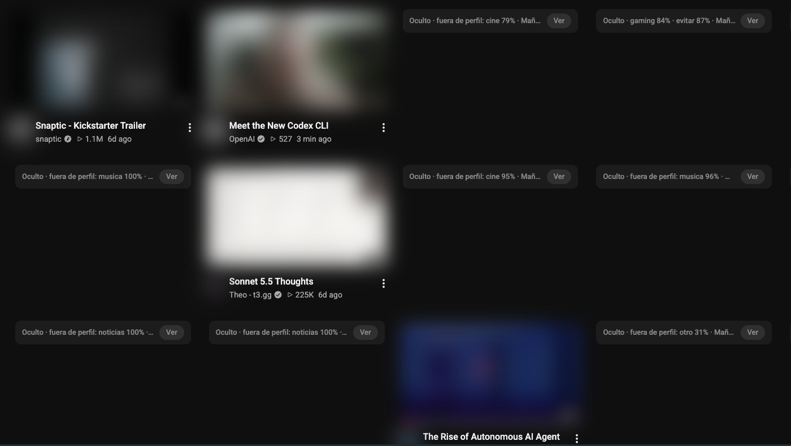

<div align="center">

# Sintonía

**Your YouTube feed, filtered by what you actually want to watch — at this hour.**

*Mornings for learning, nights for music and comedy. A Chrome extension that hides everything else, and can teach YouTube's own algorithm to stop suggesting it.*

[](https://github.com/Chere3/sintonia/actions/workflows/ci.yml)
[](LICENSE)
[](https://developer.chrome.com/docs/extensions/develop/migrate/what-is-mv3)
[](https://bun.sh)

[Español](README.es.md) · [Performance](#performance-you-never-see-an-unfiltered-card) · [How it works](#how-it-works) · [Install](#install) · [Privacy](#what-leaves-your-machine) · [Limitations](#honest-limitations)



<sub>Morning profile: programming and tech stay; film, music, news and gaming are collapsed with the reason. Thumbnails blurred for the screenshot.</sub>

</div>

## Why this exists

YouTube's recommendations optimize for one thing: that you keep watching. They don't know that
at 9 a.m. you wanted a talk on compilers, not the drama video that kept you up last night.

The built-in controls are blunt. "Not interested" works one video at a time, and it's permanent:
it can't tell "not now" from "never". Sintonía adds the missing piece, **time**:

- You define **topics** in plain language ("programming, software, AI tutorials").
- You define **profiles by time of day**: what you want, what you avoid, and how strict to be.
- Every recommendation is classified and either shown, or collapsed with the reason
  (`Hidden · gaming 84% · avoid 87% · Morning`, with a one-click *Show* button).

## Performance: you never see an unfiltered card

The point of a filter is lost if you can click a video before it's filtered. Sintonía is
**fail-closed**: every card is invisible and unclickable from the first frame YouTube renders
it, until it has a decision. The veil is plain CSS, injected before the page's DOM exists, so
it doesn't depend on any script being fast. Measured on a live feed in Dia (Chromium), October
2026:

| | Before (0.1.0) | Now |
|---|---|---|
| Cards visible and clickable before being filtered | 21 of 21 | **0 of 101** |
| Time an unfiltered video was clickable (p50) | 1,067 ms | **0 ms** |
| Skeleton shown while deciding, cached video | — | 0–114 ms |
| Skeleton shown while deciding, new video (p50) | — | 194–276 ms (one Jev round-trip) |

Where the time went, and what fixed it:

- **Cache reads were O(cache), not O(batch).** Every request read and rewrote the full
  classification map (up to 5,000 entries). Now there's one storage key per video, and config
  and profile live in memory.
- **Batches waited for their slowest member.** Cached and rule-decided cards are now answered
  immediately, and each new classification is pushed to the tab as soon as it resolves.
- **The scan was debounced during rendering.** YouTube mutates the DOM continuously while it
  paints a feed, so a 300 ms debounce kept postponing itself. It's now a 50 ms throttle that
  never pushes back a scheduled scan (cache hits went from 163 ms to 34 ms).
- **SPA navigation reported the old page.** YouTube renders the home cards before it updates
  `location`, so they were scanned only after navigation finished. The target path now comes
  from `yt-navigate-start`.
- **Recycled cards.** YouTube reuses the outer card across feeds but always creates a new inner
  `yt-lockup-view-model`, so the "decided" mark lives on the inner element: a recycled card is
  veiled by construction.

Reproduce it with [`tools/measure.js`](tools/measure.js) in the DevTools console.

If no decision arrives within 4 s (dead worker, missing key), the card is shown anyway, so a
failure never blanks YouTube.

## What it does

- **Home feed and watch-page sidebar** are filtered live, including infinite scroll.
- **Autoplay guard.** When a video ends, if YouTube was about to autoplay something you'd have
  hidden, Sintonía jumps to the first video you actually want instead.
- **Time-based profiles** (`06:00–14:00`, `20:00–06:00`… ranges can wrap midnight), with a
  manual override in the popup.
- **Rules before AI:** allow/block lists for channels and keywords, global or per profile.
- **Retraining (opt-in):** it can click YouTube's own *Not interested* /
  *Don't recommend channel* for you. This ships in **dry-run mode** and only fires for things you
  avoid in *every* profile, so a morning-only filter never poisons your evening feed.

## How it works

```
 YouTube page (content script)                    Service worker
 ─────────────────────────────                    ──────────────
 card → title, channel, duration ───────────────▶ rules (channels, keywords)
                                                  │
                                                  ▼
                                   1. classify on title ──── confident? ──▶ decide
                                                  │ doubtful
 description, category, tags ◀── needDetails ─────┘
 (YouTube's own /player endpoint, same origin)
          └──────────────────────────────────────▶ 2. classify again ── confident? ──▶ decide
                                                  │ still doubtful
                                                  ▼
                                   3. transcript, fetched by the service worker ──▶ classify ──▶ decide
                                      (same requests as youtube-transcript-api, cached per video)
```

**Cheapest signal first.** Titles are often clickbait, so the extension escalates only when the
current profile can't decide yet: first YouTube's own category, tags and description, and only
then the transcript. On a real home feed this left **0 undecided videos out of 24**, with no
transcript requests at all.

**Decisions use probability mass, not the top label.** The classifier answers one multiple-choice
question over all your topics and returns a probability for each. A Kurzgesagt video on AI agents
came back *programming 46% · science 39% · tech 15%*. No single topic passes a 70% threshold, but
all three are wanted in the morning, so it's a confident **show (100%)**.

**One classification, every profile.** The question doesn't depend on the profile, so results are
cached per video and switching from *Morning* to *Night* re-decides the whole feed instantly,
without new API calls.

The classifier is [Jev](https://docs.typesafe.ai) (TypeSafe AI), a fast typed-decision API
(~0.2 s per call). [Laya](https://huggingface.co/convaiinnovations/laya), an open-weights model
that speaks the same protocol, can be used as a local backend instead.

## Install

Requirements: a Chromium browser (Chrome, Arc, Brave, Dia…) and a Jev API key (or a local
Laya server). Nothing else to install or run.

```bash
git clone https://github.com/Chere3/sintonia.git
```

1. Open `chrome://extensions`, enable **Developer mode**, click **Load unpacked** and pick the
   `extension/` folder.
2. Open the extension's options, paste your Jev key, and edit topics and profiles.
3. Open YouTube.

Or skip the clone: download the zip from the [latest release](https://github.com/Chere3/sintonia/releases/latest)
and load the unzipped folder.

<details>
<summary>Example profile</summary>

```json
{
  "id": "manana",
  "nombre": "Mañana",
  "desde": "06:00",
  "hasta": "14:00",
  "estricto": true,
  "quiero": ["programacion", "ciencia", "negocios", "tecnologia"],
  "evitar": ["drama", "gaming", "humor"],
  "canales": { "permitir": [], "bloquear": [] },
  "palabras": { "permitir": [], "bloquear": [] }
}
```

`estricto: true` hides anything that isn't clearly in `quiero`. Without it, only `evitar` topics
are hidden. Config keys are in Spanish, like the rest of the UI.
</details>

## What leaves your machine

| Data | Where it goes | When |
|---|---|---|
| Title, channel, duration | Jev API (`api.typesafe.ai`) | Every new video, once |
| Description, category, tags | Jev API | Only when the title alone was doubtful |
| First ~1,800 chars of the transcript | Jev API | Only when still doubtful |
| Everything | Nowhere | With the Laya backend, it all stays local |

Sintonía never reads your watch history or cookies, and sends nothing about your account to
any third party. Transcript requests go to YouTube without cookies, so they aren't tied to your account.

## Honest limitations

- **YouTube rate-limits transcript scraping.** About 45 transcripts in a short burst got a
  residential IP blocked (`IpBlocked`). That's why transcripts are the last resort, fetched
  one at a time with 2–4 s jitter, with a 30 min backoff (doubling) on a block. Cached
  transcripts keep working while blocked.
- **The Laya backend is untested end-to-end.** It speaks the same wire protocol as Jev, but the base
  checkpoint is near chance zero-shot, so use the fine-tuned `typed-decisions` model.
- **It depends on YouTube's DOM.** Selectors were taken from the live page in October 2026
  (`ytd-rich-item-renderer`, `yt-lockup-view-model`, `content-id-*`). YouTube will change them.
- **Clickbait can still win.** A confidently misleading title is classified and cached as is.
  *Clear cache* in the options, or a channel allow-list entry, fixes it.
- **Home feed, watch sidebar and autoplay only.** Shorts, search and subscriptions are untouched.
- **The end-of-video suggestion grid is not filtered yet**, only the autoplay pick.
- **The autoplay guard was verified with a simulated end of video**, not yet across many real
  autoplay countdowns. Reports welcome.

## Development

```bash
bun test                 # pure logic: profiles, rules, decisions, pipeline, migrations
```

No build step. Edit, then hit ↻ on the extension card. [`CLAUDE.md`](CLAUDE.md) documents the
invariants: node recycling, cache versioning, why feedback is global-only, and how to test the
autoplay guard without touching your real settings.

## License

[MIT](LICENSE)
